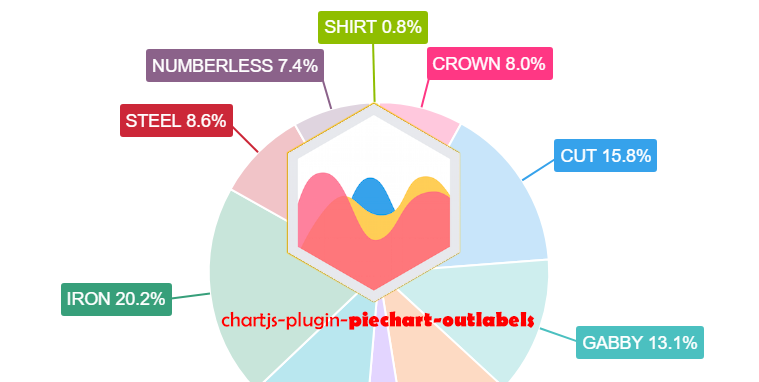

    

Highly customizable [Chart.js](http://www.chartjs.org/) plugin that displays labels outside the pie/doughnut chart.

**Important:** requires [Chart.js](https://github.com/chartjs/Chart.js/releases) **2.7.0** or later.

## Table of Contents



## License

`chartjs-plugin-piechart-outlabels` is available under the [MIT license](https://github.com/neckster/chartjs-plugin-piechart-outlabels/blob/master/LICENSE.md).

## P.S.

Highly inspirated by [chartjs-plugin-datalabels](https://github.com/chartjs/chartjs-plugin-datalabels)!