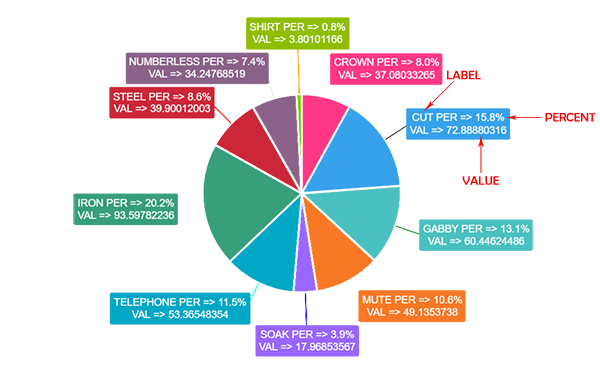
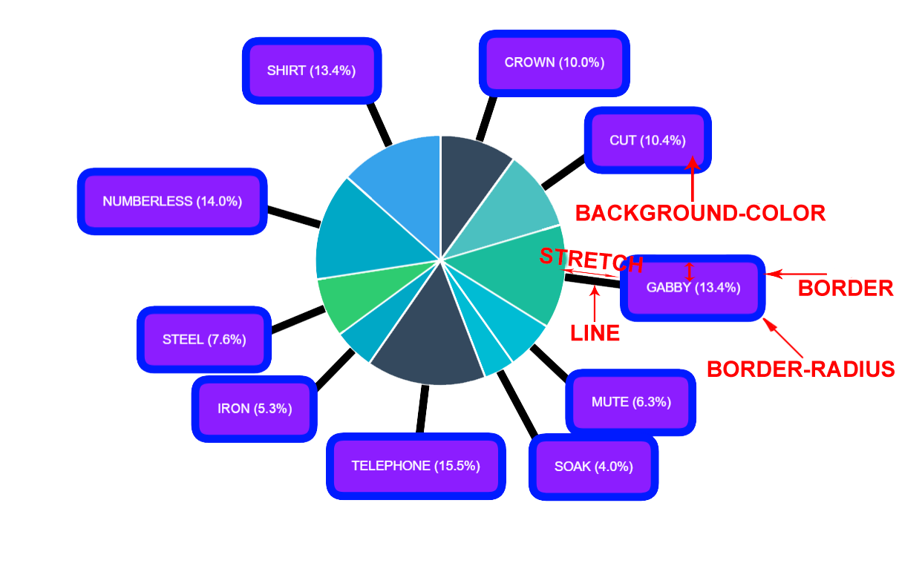

# Formatting and Styling

##Text

Label's content can be controlled by changing the text option's value. Labels can be displayed on multiple lines by using the newline character (`\n`) between each line.

> **Tip:** the space between each line can be adjusted using the `font.lineHeight` option.

Following scopes will be replaced automatically:

- `%l`: will be replaced by `Label` of the data
- `%p`: will be replaced by `Percent` of the data
- `%v`: will be replaced by `Value` of the data
- `\n`: will be replaced by `New Line`


Example:

```javascript
outlabels: {
	text: '%l PER => %p \n VAL => %v'
}
```
Result:



## Text Alignment

The `textAlign` option only applies to multiline labels and specifies the text alignment being used when drawing the label text (see [`CanvasRenderingContext2D.textAlign`](https://developer.mozilla.org/en-US/docs/Web/API/CanvasRenderingContext2D/textAlign)). Note that  right-to-left text detection based on the current locale is not currently implemented.

Supported values for `textAlign`:

- `start` (default): the text is left-aligned
- `center`: the text is centered
- `end`: the text is right-aligned
- `left`: alias of `start`
- `right`: alias of `right`


## Graph Styling

There are plenty of options available for Label's styling

Example:

```javascript
outlabels: {
	backgroundColor: "#8C1DFF", // Background color of Label
	borderColor: "#001BFF", // Border color of Label
	borderRadius: 17, // Border radius of Label
	borderWidth: 10, // Thickness of border
	color: 'white', // Font color
	display: true,
	lineWidth: 10, // Thickness of line between chart arc and Label
	padding: 17,
	stretch: 100, // The length between chart arc and Label
	text: "%l (%p)"
	textAlign: "center"
}
```

